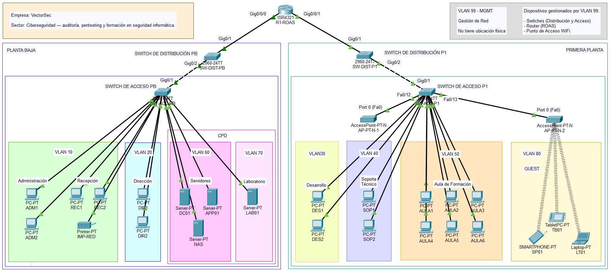
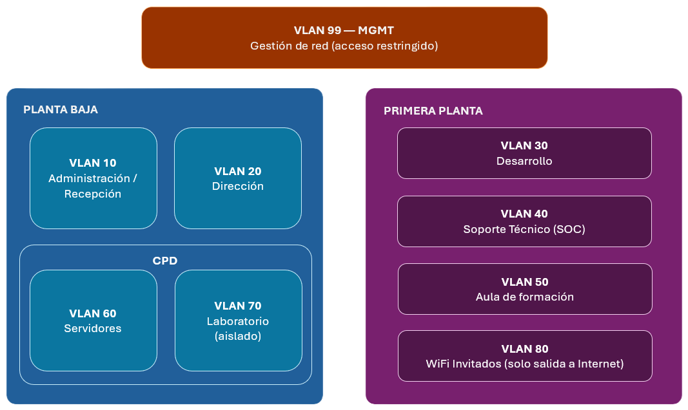
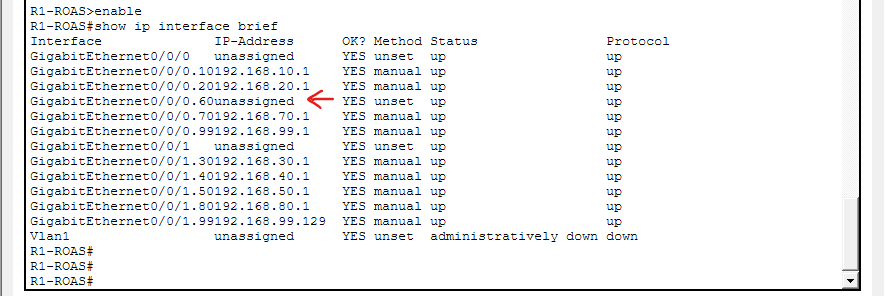
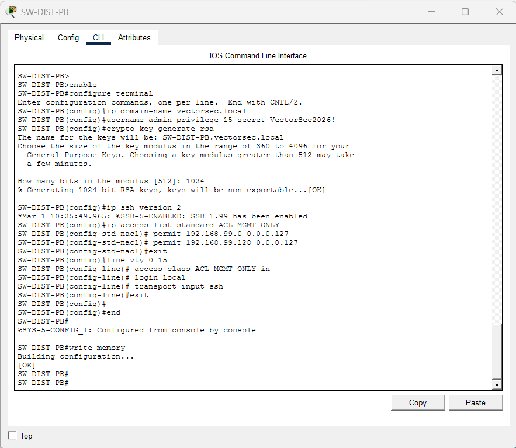

# Módulo 3 — Planificación y Administración de Redes

**Empresa:** VectorSec
**Sector:** Ciberseguridad — auditoría, pentesting y formación en seguridad informática
**Entorno de simulación:** Cisco Packet Tracer

---

## 1. Introducción

**VectorSec** es una empresa de ciberseguridad en fase de crecimiento (8-9 empleados) que ofrece servicios de auditoría, pentesting, consultoría de cumplimiento normativo y formación in-company a pymes. Como parte de su proceso de modernización interna, este módulo diseña, implementa y documenta la red interna de la empresa, distribuida en dos plantas, aplicando criterios de segmentación, control de acceso y gestión propios de una empresa que basa su negocio en la seguridad informática.

Todas las decisiones de diseño de este módulo parten de una misma idea: ***una empresa que audita la seguridad de terceros debe, por coherencia, aplicar sobre su propia infraestructura los mismos criterios que exige a sus clientes*.**

---

## 2. Topología física

La red se organiza en dos niveles por planta: un switch de **distribución** (enlace troncal hacia el router) y un switch de **acceso** (conexión de equipos finales). El router realiza el enrutamiento inter-VLAN mediante **Router on a Stick (ROAS)**.



| Elemento | Modelo | Rol |
| :--- | :--- | :--- |
| Router | Cisco 4321 ISR | ROAS — enrutamiento inter-VLAN mediante subinterfaces |
| SW-DIST-PB / SW-DIST-P1 | Cisco 2960 | Distribución — enlaces troncales |
| SW-ACC-PB / SW-ACC-P1 | Cisco 2960 | Acceso — conexión de equipos finales |
| AP-PT-N-1 / AP-PT-N-2 | Cisco AP-PT-N | Punto de acceso WiFi (empleados / invitados) |

### 2.1 Justificación: Router on a Stick frente a Switch de Capa 3

Se descarta el uso de un switch de Capa 3 pese a ofrecer mejor rendimiento y escalabilidad, por los siguientes motivos:

- **Coherencia con el tamaño y fase de la empresa.** VectorSec es una empresa que optimiza recursos; un switch de Capa 3 supondría un sobrecoste no justificado por el volumen de tráfico actual (8-9 empleados, 16 equipos cliente).
- **Reutilización del hardware obligatorio.** El router exigido por el proyecto ya asume el enrutamiento sin necesidad de hardware adicional.
- **Los switches Cisco 2960 disponibles no soportan SVIs de enrutamiento**, lo que refuerza técnicamente la decisión tomada.
- Queda documentado como mejora futura ante el crecimiento de **VectorSec**, en línea con su visión de escalado progresivo.

### 2.2 Justificación: modelo único de switch (Cisco 2960)

Se utiliza el mismo modelo Cisco 2960 en las 4 posiciones (distribución y acceso). No es una limitación, sino una decisión deliberada: unificar el catálogo de equipos de red simplifica el mantenimiento, la gestión de repuestos y la configuración, sin sacrificar capacidad técnica (soporta VLANs, trunking 802.1Q y port-security).

### 2.3 Criterio de conectividad Fast/Gigabit

| Conexión | Tipo de puerto | Motivo |
| :--- | :--- | :--- |
| PC / servidor → switch de acceso | FastEthernet | Tráfico de oficina/servidor no justifica Gigabit dedicado |
| Switch de acceso → switch de distribución | GigabitEthernet | Agrega el tráfico de toda una planta |
| Switch de distribución → Router | GigabitEthernet | Concentra el tráfico inter-VLAN de toda la planta |
| Switch de acceso → puntos de acceso WiFi | FastEthernet (acceso, no trunk) | Cada AP resuelto en modo dedicado (ver apartado 5) |

---

## 3. Segmentación lógica — VLANs

Se implementan **9 VLANs**: las 7 exigidas para el proyecto, más 2 adicionales justificadas por necesidades reales de seguridad de **VectorSec**.



| VLAN | Nombre | Red / Máscara | Departamento / Uso |
| :--- | :--- | :--- | :--- |
| 10 | ADMIN | 192.168.10.0/24 | Administración + Recepción |
| 20 | DIR | 192.168.20.0/24 | Dirección |
| 30 | DEV | 192.168.30.0/24 | Desarrollo |
| 40 | SOPORTE | 192.168.40.0/24 | Soporte técnico (SOC) |
| 50 | FORMACION | 192.168.50.0/24 | Aula de formación |
| 60 | SRV | 192.168.60.0/24 | Servidores (CPD): AD, aplicaciones/BD, NAS |
| 70 | LAB *(adicional)* | 192.168.70.0/24 | Servidor de laboratorio aislado (malware/pentesting) |
| 80 | GUEST *(adicional)* | 192.168.80.0/24 | Invitados WiFi — solo salida a Internet |
| 99 | MGMT | 192.168.99.0/25 (PB) · 192.168.99.128/25 (P1) | Gestión de red — sin ubicación física |

**Justificación de las VLANs adicionales:**

- **VLAN 70 (LAB):** el servidor de laboratorio requiere aislamiento real para análisis de malware controlado. Compartir VLAN con el resto de servidores habría hecho imposible aplicar ACLs específicas sobre él, ya que las ACLs actúan entre VLANs, no dentro de una misma VLAN.
- **VLAN 80 (GUEST):** el proyecto exige una red de invitados "aislada, solo salida a Internet". Ninguna de las 7 VLANs obligatorias cumplía ese rol.

> **Nota sobre Recepción:** no dispone de VLAN propia en la especificación original, por lo que se integra en la VLAN 10 (ADMIN), al compartir el mismo nivel de confianza que **Administración**.
>
> **Nota sobre VLAN 99 (MGMT):** al ser una VLAN transversal sin switch de interconexión directa entre plantas, se divide en dos subredes /25 independientes (una por planta), **evitando el solapamiento de red** que se detectó durante la configuración del router (ver apartado 4.2).

---

## 4. Direccionamiento IP

### 4.1 Tabla de direccionamiento por VLAN

| VLAN | Red | Gateway | Rango DHCP | Reservado estático |
| :--- | :--- | :--- | :--- | :--- |
| 10 – ADMIN | 192.168.10.0/24 | .1 | .10 – .100 | .2 – .9 |
| 20 – DIR | 192.168.20.0/24 | .1 | .10 – .100 | .2 – .9 |
| 30 – DEV | 192.168.30.0/24 | .1 | .10 – .100 | .2 – .9 |
| 40 – SOPORTE | 192.168.40.0/24 | .1 | .10 – .100 | .2 – .9 |
| 50 – FORMACION | 192.168.50.0/24 | .1 | .10 – .150 | .2 – .9 |
| 60 – SRV | 192.168.60.0/24 | .1 | *(sin DHCP)* | Todo estático |
| 70 – LAB | 192.168.70.0/24 | .1 | *(sin DHCP)* | Todo estático |
| 80 – GUEST | 192.168.80.0/24 | .1 | .10 – .200 | .2 – .9 |
| 99 – MGMT (PB) | 192.168.99.0/25 | .1 | *(sin DHCP)* | Todo estático |
| 99 – MGMT (P1) | 192.168.99.128/25 | .129 | *(sin DHCP)* | Todo estático |

### 4.2 Incidencia detectada y resuelta: solapamiento en VLAN 99

Al configurar inicialmente ambas subinterfaces de gestión con la misma subred `/24` (`192.168.99.1` y `192.168.99.254`), el router rechazó la configuración:

```bash
% 192.168.99.0 overlaps with GigabitEthernet0/0/0.99
```

**Incidencia:** ambas ramas de VLAN 99 son dominios de difusión físicamente independientes (los switches de distribución de cada planta no están conectados entre sí; solo se comunican a través del router), por lo que no pueden compartir la misma subred en dos interfaces distintas del router.

**Solución:** división del bloque `192.168.99.0/24` en dos `/25`, una por rama física, tal como se muestra en la tabla anterior.

### 4.3 Direcciones estáticas — Servidores

| Equipo | IP | VLAN | Puerto (SW-ACC-PB) |
| :--- | :--- | :--- | :--- |
| Server-DC01 (Dominio/AD) | 192.168.60.10 | 60 | Fa0/9 |
| Server-APP01 (Aplicaciones/BD) | 192.168.60.11 | 60 | Fa0/10 |
| Server-NAS (Backups) | 192.168.60.12 | 60 | Fa0/11 |
| Server-LAB01 (Laboratorio aislado) | 192.168.70.10 | 70 | Fa0/1 |
| Printer-IMP-RED | 192.168.10.5 | 10 | Fa0/2–6 |

### 4.4 Direcciones estáticas — Gestión (VLAN 99)

| Equipo | IP |
| :--- | :--- |
| Router R1-ROAS (rama PB) | 192.168.99.1 |
| Router R1-ROAS (rama P1) | 192.168.99.129 |
| SW-DIST-PB | 192.168.99.2 |
| SW-ACC-PB | 192.168.99.3 |
| SW-DIST-P1 | 192.168.99.130 |
| SW-ACC-P1 | 192.168.99.131 |

> **Nota:** los puntos de acceso WiFi (modelo AP-PT-N) no disponen de interfaz de gestión IP propia, a diferencia de los switches. Su segmentación de tráfico se garantiza mediante puerto de acceso dedicado en su VLAN correspondiente (ver apartado 5).

---

## 5. Punto de acceso WiFi — Resolución técnica

### 5.1 El modelo de AP inicial no soporta múltiples SSID con VLAN

**Incidencia:** El PDF exige un único punto de acceso con dos SSID (`SSID_EMPRESA` y `SSID_INVITADOS`), cada uno mapeado a una VLAN distinta. Los modelos genéricos de Packet Tracer (AP-PT, PT-N, PT-A, PT-AC) son simuladores de punto de acceso doméstico/SOHO: **admiten una única SSID por dispositivo, sin trunking 802.1Q ni asignación de VLAN por SSID** — funcionalidad exclusiva de equipos empresariales gestionables por CLI, fuera del alcance de este proyecto.

**Solución:** sustitución del AP único por **dos puntos de acceso físicos** (modelo Cisco AP-PT-N), cada uno conectado a un puerto de acceso dedicado del switch, en su VLAN correspondiente — en lugar de un único AP en modo trunk.

| Punto de acceso | SSID | VLAN | Puerto (SW-ACC-P1) | Autenticación |
| --- | --- | --- | --- | --- |
| AP-PT-N-1 | SSID_EMPRESA | 40 | Fa0/12 (access) | WPA2-PSK / AES |
| AP-PT-N-2 | SSID_INVITADOS | 80 | Fa0/13 (access) | Abierta (sin cifrado) |

---

## 6. Configuración de switches

### 6.1 Criterios generales aplicados a los 4 switches

- **Se crean las 9 VLANs en todos los switches** (no se usa VTP, por control total y para evitar un vector de error/seguridad habitual).
- **Todos los puertos no utilizados** se dejan en `shutdown` (buena práctica de seguridad física: tener en cuenta que un puerto libre y activo es una entrada no vigilada).
- Los enlaces `switch-switch` y `switch-router` se configuran en modo `trunk` con encapsulación 802.1Q, permitiendo únicamente las VLANs necesarias en cada tramo (no se permiten VLANs de la otra planta por un trunk donde nunca habrá tráfico de esas VLANs).

**Incidencia:** el comando `switchport trunk encapsulation dot1q` no es válido en el Cisco 2960 (`Invalid input detected`), ya que este modelo solo soporta 802.1Q de fábrica, sin alternativa ISL que requiera selección explícita.

**Solución:** Se omite esta línea en todas las configuraciones de trunk.

### 6.2 SW-ACC-PB — Switch de acceso (planta baja)

```bash
enable
configure terminal
hostname SW-ACC-PB

! --- Creación de las 9 VLANs ---
vlan 10
 name ADMIN
vlan 20
 name DIR
vlan 30
 name DEV
vlan 40
 name SOPORTE
vlan 50
 name FORMACION
vlan 60
 name SRV
vlan 70
 name LAB
vlan 80
 name GUEST
vlan 99
 name MGMT
exit

! --- Puerto LAB01 (aislado en VLAN 70) ---
interface fa0/1
 switchport mode access
 switchport access vlan 70
 spanning-tree portfast
 no shutdown

! --- Puertos Administración + Recepción (VLAN 10) ---
interface range fa0/2 - 6
 switchport mode access
 switchport access vlan 10
 spanning-tree portfast
 no shutdown

! --- Puertos Dirección (VLAN 20) ---
interface range fa0/7 - 8
 switchport mode access
 switchport access vlan 20
 spanning-tree portfast
 no shutdown

! --- Servidores DC01, APP01, NAS (VLAN 60) ---
interface fa0/9
 switchport mode access
 switchport access vlan 60
 no shutdown
interface fa0/10
 switchport mode access
 switchport access vlan 60
 no shutdown
interface fa0/11
 switchport mode access
 switchport access vlan 60
 no shutdown

! --- Enlace troncal hacia SW-DIST-PB ---
interface gig0/1
 switchport mode trunk
 switchport trunk allowed vlan 10,20,60,70,99
 no shutdown

! --- Puertos sin uso: apagados por seguridad ---
interface range fa0/12 - 24
 shutdown
interface gig0/2
 shutdown

interface vlan 99
 ip address 192.168.99.3 255.255.255.128
 no shutdown
exit
ip default-gateway 192.168.99.1

end
write memory
```

### 6.3 SW-ACC-P1 — Switch de acceso (primera planta)

```bash
enable
configure terminal
hostname SW-ACC-P1

! (creamos las 9 VLANs — idéntico a 6.2)

! --- Puertos Desarrollo (VLAN 30) ---
interface range fa0/2 - 3
 switchport mode access
 switchport access vlan 30
 spanning-tree portfast
 no shutdown

! --- Puertos Soporte Técnico (VLAN 40) ---
interface range fa0/4 - 5
 switchport mode access
 switchport access vlan 40
 spanning-tree portfast
 no shutdown

! --- Puertos Aula de Formación (VLAN 50) ---
interface range fa0/6 - 11
 switchport mode access
 switchport access vlan 50
 spanning-tree portfast
 no shutdown

! --- Puertos hacia los puntos de acceso WiFi (acceso, no trunk) ---
interface fa0/12
 switchport mode access
 switchport access vlan 40
 no shutdown

interface fa0/13
 switchport mode access
 switchport access vlan 80
 no shutdown

! --- Enlace troncal hacia SW-DIST-P1 ---
interface gig0/1
 switchport mode trunk
 switchport trunk allowed vlan 30,40,50,80,99
 no shutdown

! --- Puertos sin uso: apagados por seguridad ---
interface fa0/1
 shutdown
interface range fa0/14 - 24
 shutdown
interface gig0/2
 shutdown

interface vlan 99
 ip address 192.168.99.131 255.255.255.128
 no shutdown
exit
ip default-gateway 192.168.99.129

end
write memory
```

### 6.4 SW-DIST-PB y SW-DIST-P1 — Switches de distribución

Ambos son switches **"puente"** entre el router y el switch de acceso de su planta: no tienen puertos de acceso a equipos finales, solo dos enlaces troncales con las VLANs propias de esa planta.

```bash
! SW-DIST-PB
enable
configure terminal
hostname SW-DIST-PB

! (creamos las 9 VLANs)

! --- Enlace troncal hacia el Router (ROAS) ---
interface gig0/1
 switchport mode trunk
 switchport trunk allowed vlan 10,20,60,70,99
 no shutdown

! --- Enlace troncal hacia SW-ACC-PB ---
interface gig0/2
 switchport mode trunk
 switchport trunk allowed vlan 10,20,60,70,99
 no shutdown

! --- Puertos sin uso: apagados por seguridad ---
interface range fa0/1 - 24
 shutdown

interface vlan 99
 ip address 192.168.99.2 255.255.255.128
 no shutdown
exit
ip default-gateway 192.168.99.1

end
write memory
```

```bash
! SW-DIST-P1
enable
configure terminal
hostname SW-DIST-P1

! (creamos las 9 VLANs)

! --- Enlace troncal hacia el Router (ROAS) ---
interface gig0/1
 switchport mode trunk
 switchport trunk allowed vlan 30,40,50,80,99
 no shutdown

! --- Enlace troncal hacia SW-ACC-P1 ---
interface gig0/2
 switchport mode trunk
 switchport trunk allowed vlan 30,40,50,80,99
 no shutdown

! --- Puertos sin uso: apagados por seguridad ---
interface range fa0/1 - 24
 shutdown

interface vlan 99
 ip address 192.168.99.130 255.255.255.128
 no shutdown
exit
ip default-gateway 192.168.99.129

end
write memory
```

---

## 7. Configuración del router — Inter-VLAN Routing (ROAS)

```bash
enable
configure terminal
hostname R1-ROAS

! --- Activamos la interfaz física (obligatorio antes de las subinterfaces) ---
interface gig0/0/0
 no shutdown
exit
interface gig0/0/1
 no shutdown
exit

! --- Subinterfaces hacia Planta Baja (gig0/0/0) ---
interface gig0/0/0.10
 encapsulation dot1Q 10
 ip address 192.168.10.1 255.255.255.0
exit
interface gig0/0/0.20
 encapsulation dot1Q 20
 ip address 192.168.20.1 255.255.255.0
exit
interface gig0/0/0.60
 encapsulation dot1Q 60
 ip address 192.168.60.1 255.255.255.0
exit
interface gig0/0/0.70
 encapsulation dot1Q 70
 ip address 192.168.70.1 255.255.255.0
exit
interface gig0/0/0.99
 encapsulation dot1Q 99
 ip address 192.168.99.1 255.255.255.128
exit

! --- Subinterfaces hacia Primera Planta (gig0/0/1) ---
interface gig0/0/1.30
 encapsulation dot1Q 30
 ip address 192.168.30.1 255.255.255.0
exit
interface gig0/0/1.40
 encapsulation dot1Q 40
 ip address 192.168.40.1 255.255.255.0
exit
interface gig0/0/1.50
 encapsulation dot1Q 50
 ip address 192.168.50.1 255.255.255.0
exit
interface gig0/0/1.80
 encapsulation dot1Q 80
 ip address 192.168.80.1 255.255.255.0
exit
interface gig0/0/1.99
 encapsulation dot1Q 99
 ip address 192.168.99.129 255.255.255.128
exit

end
write memory
```

### Pruebas de conectividad

- SW-ACC-PB: show vlan brief — `Ok`
- SW-ACC-PB: show interface status — `Ok`
- R1-ROAS: show ip interface brief — `corregir`

**Incidencia detectada:** la subinterfaz `gig0/0/0.60` quedó como `unassigned` en `show ip interface brief` pese a haberlo configurado aparentemente bien, provocando `Destination host unreachable` en todas las pruebas hacia la VLAN 60.



**Solución aplicada:** Se resolvió reintroduciendo el bloque completo de la subinterfaz. Diagnóstico realizado comparando el estado de todas las subinterfaces mediante `show ip interface brief`, aislando el fallo a una única VLAN antes de intervenir.

---

## 8. DHCP por VLAN

Solo las VLANs con equipos de usuario final disponen de DHCP. **Recuerda:** *VLAN 60 (Servidores), 70 (Laboratorio) y 99 (MGMT) no llevan DHCP*

```bash
! R1-ROAS
enable
configure terminal

ip dhcp excluded-address 192.168.10.1 192.168.10.9
ip dhcp excluded-address 192.168.20.1 192.168.20.9
ip dhcp excluded-address 192.168.30.1 192.168.30.9
ip dhcp excluded-address 192.168.40.1 192.168.40.9
ip dhcp excluded-address 192.168.50.1 192.168.50.9
ip dhcp excluded-address 192.168.80.1 192.168.80.9

ip dhcp pool VLAN10-ADMIN
 network 192.168.10.0 255.255.255.0
 default-router 192.168.10.1
exit

ip dhcp pool VLAN20-DIR
 network 192.168.20.0 255.255.255.0
 default-router 192.168.20.1
exit

ip dhcp pool VLAN30-DEV
 network 192.168.30.0 255.255.255.0
 default-router 192.168.30.1
exit

ip dhcp pool VLAN40-SOPORTE
 network 192.168.40.0 255.255.255.0
 default-router 192.168.40.1
exit

ip dhcp pool VLAN50-FORMACION
 network 192.168.50.0 255.255.255.0
 default-router 192.168.50.1
exit

ip dhcp pool VLAN80-GUEST
 network 192.168.80.0 255.255.255.0
 default-router 192.168.80.1
exit

end
write memory
```

> *(El servidor DNS se integrará en los pools durante el Módulo 2, al desplegarse sobre SRV-DC01).*

---

## 9. Políticas de acceso — ACLs

### 9.1 Políticas obligatorias (PDF) y refuerzos añadidos

| # | Política | Origen |
| --- | :--- | :--- |
| 1 | Aula de Formación no accede a Dirección | Obligatoria |
| 2 | Desarrollo no accede a Administración | Obligatoria |
| 3 | Administración sí accede a Servidores | Obligatoria (permitido por defecto) |
| 4 | Solo VLAN MGMT administra dispositivos de red | Obligatoria |
| 5 | GUEST no accede a ninguna VLAN interna (solo Internet) | Refuerzo — necesario para cumplir el aislamiento exigido al SSID_INVITADOS |
| 6 | LAB no inicia tráfico hacia el resto de VLANs, salvo Soporte (SOC) | Refuerzo — necesario para que el aislamiento del servidor de laboratorio sea real |

### 9.2 ACLs aplicadas en R1-ROAS (entrantes `in` por subinterfaz)

```bash
! R1-ROAS
enable
configure terminal

! ============================================
! VLAN 10 - ADMIN
! Regla: NO puede llegar a la gestión de red (MGMT)
! Regla: SÍ puede llegar a Servidores (permitido por defecto, sin deny)
! ============================================
ip access-list extended ACL-ADMIN-IN
 deny ip 192.168.10.0 0.0.0.255 192.168.99.0 0.0.0.127
 deny ip 192.168.10.0 0.0.0.255 192.168.99.128 0.0.0.127
 permit ip any any

! ============================================
! VLAN 20 - DIR
! Regla: NO puede llegar a la gestión de red (MGMT)
! (el bloqueo de Formación hacia Dirección se aplica en la VLAN 50, no aquí)
! ============================================
ip access-list extended ACL-DIR-IN
 deny ip 192.168.20.0 0.0.0.255 192.168.99.0 0.0.0.127
 deny ip 192.168.20.0 0.0.0.255 192.168.99.128 0.0.0.127
 permit ip any any

! ============================================
! VLAN 30 - DEV
! Regla obligatoria: NO puede acceder a Administración
! Regla: NO puede llegar a la gestión de red
! ============================================
ip access-list extended ACL-DEV-IN
 deny ip 192.168.30.0 0.0.0.255 192.168.10.0 0.0.0.255
 deny ip 192.168.30.0 0.0.0.255 192.168.99.0 0.0.0.127
 deny ip 192.168.30.0 0.0.0.255 192.168.99.128 0.0.0.127
 permit ip any any

! ============================================
! VLAN 40 - SOPORTE
! Regla: NO puede llegar a la gestión de red
! (SÍ puede llegar a LAB - VLAN 70 - permitido por defecto, es el SOC)
! ============================================
ip access-list extended ACL-SOPORTE-IN
 deny ip 192.168.40.0 0.0.0.255 192.168.99.0 0.0.0.127
 deny ip 192.168.40.0 0.0.0.255 192.168.99.128 0.0.0.127
 permit ip any any

! ============================================
! VLAN 50 - FORMACION
! Regla obligatoria: NO puede acceder a Dirección
! Regla: NO puede llegar a la gestión de red
! ============================================
ip access-list extended ACL-FORMACION-IN
 deny ip 192.168.50.0 0.0.0.255 192.168.20.0 0.0.0.255
 deny ip 192.168.50.0 0.0.0.255 192.168.99.0 0.0.0.127
 deny ip 192.168.50.0 0.0.0.255 192.168.99.128 0.0.0.127
 permit ip any any

! ============================================
! VLAN 60 - SRV (Servidores)
! Regla: NO puede llegar a la gestión de red
! ============================================
ip access-list extended ACL-SRV-IN
 deny ip 192.168.60.0 0.0.0.255 192.168.99.0 0.0.0.127
 deny ip 192.168.60.0 0.0.0.255 192.168.99.128 0.0.0.127
 permit ip any any

! ============================================
! VLAN 70 - LAB (Laboratorio aislado)
! Regla (refuerzo): NO puede iniciar tráfico hacia ninguna VLAN interna,
! EXCEPTO hacia Soporte Técnico (40), que es quien lo monitoriza (SOC)
! ============================================
ip access-list extended ACL-LAB-IN
 deny ip 192.168.70.0 0.0.0.255 192.168.10.0 0.0.0.255
 deny ip 192.168.70.0 0.0.0.255 192.168.20.0 0.0.0.255
 deny ip 192.168.70.0 0.0.0.255 192.168.30.0 0.0.0.255
 deny ip 192.168.70.0 0.0.0.255 192.168.50.0 0.0.0.255
 deny ip 192.168.70.0 0.0.0.255 192.168.60.0 0.0.0.255
 deny ip 192.168.70.0 0.0.0.255 192.168.80.0 0.0.0.255
 deny ip 192.168.70.0 0.0.0.255 192.168.99.0 0.0.0.127
 deny ip 192.168.70.0 0.0.0.255 192.168.99.128 0.0.0.127
 permit ip any any

! ============================================
! VLAN 80 - GUEST (Invitados)
! Regla obligatoria (PDF): VLAN aislada, solo salida a Internet
! NO puede llegar a NINGUNA VLAN interna
! ============================================
ip access-list extended ACL-GUEST-IN
 deny ip 192.168.80.0 0.0.0.255 192.168.10.0 0.0.0.255
 deny ip 192.168.80.0 0.0.0.255 192.168.20.0 0.0.0.255
 deny ip 192.168.80.0 0.0.0.255 192.168.30.0 0.0.0.255
 deny ip 192.168.80.0 0.0.0.255 192.168.40.0 0.0.0.255
 deny ip 192.168.80.0 0.0.0.255 192.168.50.0 0.0.0.255
 deny ip 192.168.80.0 0.0.0.255 192.168.60.0 0.0.0.255
 deny ip 192.168.80.0 0.0.0.255 192.168.70.0 0.0.0.255
 deny ip 192.168.80.0 0.0.0.255 192.168.99.0 0.0.0.127
 deny ip 192.168.80.0 0.0.0.255 192.168.99.128 0.0.0.127
 permit ip any any
```

Aplicamos cada ACL en su subinterfaz correspondiente.

```bash
interface gig0/0/0.10
 ip access-group ACL-ADMIN-IN in
exit
interface gig0/0/0.20
 ip access-group ACL-DIR-IN in
exit
interface gig0/0/0.60
 ip access-group ACL-SRV-IN in
exit
interface gig0/0/0.70
 ip access-group ACL-LAB-IN in
exit
interface gig0/0/1.30
 ip access-group ACL-DEV-IN in
exit
interface gig0/0/1.40
 ip access-group ACL-SOPORTE-IN in
exit
interface gig0/0/1.50
 ip access-group ACL-FORMACION-IN in
exit
interface gig0/0/1.80
 ip access-group ACL-GUEST-IN in
exit

end
write memory
```

La subinterfaz `.99` (MGMT) no lleva ACL: es la única red de confianza total, requisito para que **"solo MGMT administra dispositivos de red"** tenga sentido — el resto de VLANs tiene bloqueado el camino hacia `192.168.99.0/25` y `192.168.99.128/25`, mientras que MGMT puede llegar a cualquier destino.

### 9.3 Refuerzo de gestión — Acceso SSH restringido en los 4 switches

Además de bloquear el tráfico hacia MGMT desde el router, **se decide restringir el propio acceso remoto de gestión (VTY) en cada switch**, limitándolo a origen MGMT y forzando cifrado (SSH), en lugar de Telnet en texto plano — esto refuerza y es coherente con la actividad de **VectorSec** como empresa de ciberseguridad.

```bash
ip domain-name vectorsec.local
username admin privilege 15 secret VectorSec2026!
crypto key generate rsa
! (cuando lo pida, ingresar tamaño de clave: 1024)
ip ssh version 2

ip access-list standard ACL-MGMT-ONLY
 permit 192.168.99.0 0.0.0.127
 permit 192.168.99.128 0.0.0.127

line vty 0 15
 access-class ACL-MGMT-ONLY in
 login local
 transport input ssh
```

Aplicado de forma idéntica en `SW-DIST-PB`, `SW-ACC-PB`, `SW-DIST-P1` y `SW-ACC-P1`.



---

## 10. Pruebas realizadas

### 10.1 Conectividad básica (antes de aplicar ACLs)

| Prueba | Resultado |
| :--- | :--- |
| DHCP — asignación de IP por VLAN | ✅ Correcto |
| Ping dentro de la misma VLAN | ✅ Correcto |
| Ping entre VLANs distintas (sin restricción aún) | ✅ Correcto |
| Ping a switches de gestión (VLAN 99) | ✅ Correcto |

**Incidencia y resolución — VLAN 60 inalcanzable:** documentada en el apartado 7 (subinterfaz `gig0/0/0.60` sin IP asignada). Diagnóstico metódico: se descartó el switch (`show vlan brief` / `show interfaces
status` correctos), se descartó el servidor (encendido, IP correcta, firewall desactivado) y se aisló el fallo comparando con una VLAN funcional (70), concluyendo que el origen estaba en el router.

**Incidencia y resolución — dispositivos WiFi sin conectividad:** al sustituir el AP único por dos AP dedicados, los dispositivos inalámbricos mantenían la asociación a la SSID anterior (`Default`, ya inexistente). Se resuelve reasociando cada AP manualmente a `SSID_INVITADOS` y `SSID_EMPRESA` respectivamente.

### 10.2 Verificación de políticas ACL (después de aplicar ACLs)

| Prueba | Resultado esperado | Resultado obtenido |
| :--- | :--- | :--- |
| PC-AULA1 (VLAN 50) → PC-DIR1 (VLAN 20) | Bloqueado | ✅ Bloqueado |
| PC-DES1 (VLAN 30) → PC-ADM1 (VLAN 10) | Bloqueado | ✅ Bloqueado |
| PC-ADM1 (VLAN 10) → Server-DC01 (VLAN 60) | Permitido | ✅ Permitido |
| PC normal → switch de gestión (VLAN 99) | Bloqueado | ✅ Bloqueado |
| Dispositivo GUEST (VLAN 80) → cualquier VLAN interna | Bloqueado | ✅ Bloqueado |
| PC-SOP1 (Soporte) → Server-LAB01 (VLAN 70) | Permitido | ✅ Permitido |
| Server-LAB01 → cualquier VLAN (tráfico saliente) | Bloqueado | ✅ Bloqueado |

### 10.3 Verificación de acceso de gestión (SSH)

| Prueba | Resultado esperado | Resultado obtenido |
| :--- | :--- | :--- |
| Telnet desde PC-ADM1 (VLAN 10, fuera de MGMT) hacia un switch | Rechazado | ✅ Rechazado |
| Telnet desde origen MGMT (Telnet deshabilitado globalmente) | Rechazado | ✅ Rechazado (`Connection closed by foreign host`) |
| SSH desde SW-ACC-PB (origen MGMT) hacia SW-DIST-P1, contraseña incorrecta | Rechazado | ✅ `Login invalid` |
| SSH desde SW-ACC-PB (origen MGMT) hacia SW-DIST-P1, contraseña correcta | Acceso concedido | ✅ Acceso concedido |

Estas tres combinaciones (origen no autorizado, protocolo no autorizado, origen y protocolo autorizados) confirman que las dos capas de seguridad *—control de origen por ACL y control de protocolo por `transport input`—* funcionan de forma independiente y complementaria.

---

## 11. Conclusiones

El diseño final de red de VectorSec segmenta la actividad de la empresa en 9 VLANs, con enrutamiento inter-VLAN mediante Router on a Stick y control de acceso mediante ACLs aplicadas en el router y en el acceso de gestión de los switches. Más allá del cumplimiento de los requisitos mínimos del proyecto, cada decisión de diseño *—el servidor de laboratorio aislado, la segmentación real de la red de invitados, el acceso de gestión cifrado y restringido—* responde a la identidad de **VectorSec** como empresa de ciberseguridad: una infraestructura que aplica sobre sí misma los mismos criterios que audita en sus clientes.

El proceso de implementación puso de manifiesto, además, la importancia de verificar cada capa de la red de forma independiente antes de dar por buena una configuración: dos incidencias no triviales (el solapamiento de subredes en VLAN 99 y la subinterfaz sin IP asignada en VLAN 60) se resolvieron mediante un diagnóstico metódico, comparando el comportamiento de una VLAN afectada frente a una funcional, en lugar de realizar cambios sin un diagnóstico previo.

Como líneas de mejora futura, coherentes con la visión de crecimiento de **VectorSec**, se identifican: la migración a un switch de Capa 3 al aumentar el volumen de tráfico inter-VLAN, y la incorporación de puntos de acceso empresariales con soporte nativo de múltiples SSID sobre un único equipo físico.

---

## 12. Entregables

- `DIAGRAMA_VectorSec.pkt` — Archivo de Cisco Packet Tracer con la topología completa
- `README.md` — Este documento
- Capturas de incidencias y pruebas (carpetas `/imgs/incidents` y `/imgs/test`)
