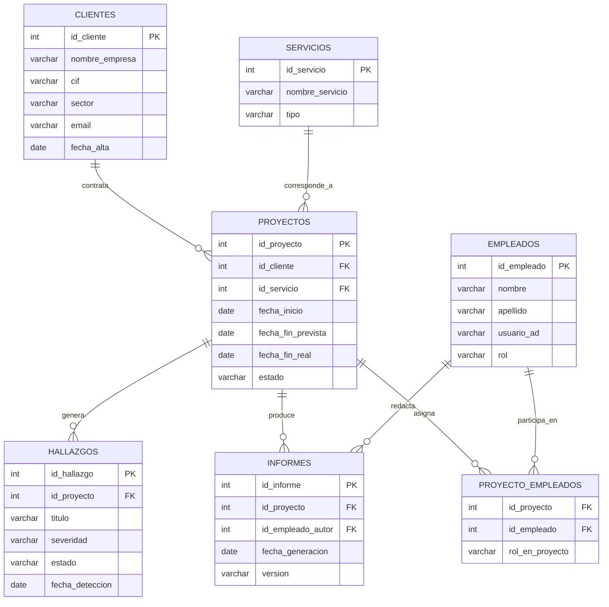

# Módulo 4 — Gestión de Base de Datos

**Empresa:** VectorSec
**Sistema gestor:** PostgreSQL 14 (sobre `SRV-APP01`, Módulo 2)
**Base de datos:** `vectorsec_gestion`

---

## 1. Introducción

Este módulo diseña, implementa y administra la base de datos que sustenta la aplicación de gestión interna de VectorSec, ya anticipada en el Módulo 2 (`servidores/SRV-APP01.md`) como el "activo más crítico" de la empresa. En consecuencia, se modela específicamente lo que una consultora de ciberseguridad necesita gestionar: *clientes, proyectos de auditoría/pentesting, hallazgos de seguridad detectados y los informes que se entregan como resultado*.

---

## 2. Identificación de la información a almacenar

| Entidad | Qué es | Por qué es necesaria | Relación con el funcionamiento del sistema |
| :--- | :--- | :--- | :--- |
| **Clientes** | Empresas que contratan servicios a VectorSec | Es el origen de todo proyecto — *sin un cliente registrado, no puede existir un proyecto* | Cada proyecto pertenece a un cliente; permite facturar y hacer seguimiento comercial |
| **Servicios** | Catálogo de lo que VectorSec ofrece (auditoría, pentesting, formación, consultoría normativa) | Estandariza qué tipo de trabajo se está realizando en cada proyecto | Cada proyecto se clasifica según el servicio contratado, útil para informes de actividad por línea de negocio |
| **Empleados** | Consultores, analistas SOC y formadores de VectorSec | Permite saber quién es responsable de cada trabajo | Se asignan a proyectos (relación muchos-a-muchos, un proyecto puede tener varios consultores) |
| **Proyectos** | Un trabajo concreto para un cliente (una auditoría, un pentest, un curso) | Es el núcleo de la actividad de VectorSec — *todo gira en torno a proyectos* | Conecta cliente, servicio y equipo asignado; tiene fechas y estado de seguimiento |
| **Hallazgos** | Vulnerabilidades o incidencias de seguridad detectadas durante un proyecto | Es el resultado técnico real de una auditoría — *sin esto, el proyecto no tiene contenido* | Cada hallazgo pertenece a un proyecto, con severidad y estado de remediación |
| **Informes** | Documento final entregado al cliente, generado a partir de los hallazgos de un proyecto | Es el entregable que el cliente realmente recibe y paga | Vinculado a un proyecto y al empleado que lo redacta |

---

## 3. Modelo Entidad-Relación



---

### Breve explicación de las relaciones en Mermaid

Quizás lo que ves en el diagrama (la notación de Mermaid) puede confundir bastante al principio porque se lee "al revés" de lo que uno esperaría intuitivamente, es decir, **¿Cómo leer `||--o{`?**, veamos:

Cada símbolo describe una restricción, pero no sobre la entidad a la que está pegado, sino sobre la entidad del otro lado, ejemplo:

- `||` (dos barras verticales) = "uno y solo uno"
- `o{` (círculo + llaves) = "cero o muchos".

Tomaremos como ejemplo: `CLIENTES → PROYECTOS`

**La clave es** que el símbolo colocado junto a `CLIENTES` no describe cuántos clientes hay — *describe **cuántos clientes le corresponden a cada proyecto***. Y el símbolo junto a `PROYECTOS` describe ***cuántos proyectos le corresponden a cada cliente***.

```text
CLIENTES ||--o{ PROYECTOS : contrata
         ↑    ↑
         |    └─ "cada CLIENTE tiene cero o muchos PROYECTOS"
         └─ "cada PROYECTO tiene uno y solo un CLIENTE"
```

> 📌 **Traduciendo:** *"**uno-y-solo-uno** pegado a Clientes, **cero-a-muchos** pegado a Proyectos"* es precisamente la forma de representar **"un Cliente, muchos Proyectos"** *(un cliente puede contratar varios proyectos... un proyecto pertenece a un único cliente)*.

### 3.1 Justificación de las relaciones

- **Clientes → Proyectos (1:N):** un cliente puede contratar varios proyectos a lo largo del tiempo; un proyecto pertenece a un único cliente.
- **Servicios → Proyectos (1:N):** cada proyecto se clasifica según un único tipo de servicio del catálogo.
- **Empleados ↔ Proyectos (N:M, vía `PROYECTO_EMPLEADOS`):** un proyecto de auditoría suele requerir varios consultores, y un consultor participa en varios proyectos a la vez — *una relación **1:N** no podría representar esto, de ahí que es necesaria la tabla intermedia*.
- **Proyectos → Hallazgos (1:N):** un proyecto genera varios hallazgos (normalmente varias vulnerabilidades por auditoría); un hallazgo pertenece a un único proyecto.
- **Proyectos → Informes (1:N):** se permite más de un informe por proyecto (por ejemplo, un informe preliminar y uno final), cada uno redactado por un empleado.

> 📌 **Sobre `usuario_ad` en Empleados:** este campo guarda el nombre de usuario de Active Directory (`nombre.apellido`, Módulo 2), sin duplicar la gestión de identidades — *la base de datos no gestiona contraseñas ni autenticación de los empleados, eso ya lo resuelve AD*. Es solo una referencia cruzada entre ambos sistemas.

---

## 4. Modelo Relacional

**Notación:** `TABLA(columna_PK, columna, columna_FK → tabla_referenciada)`

```text
CLIENTES(id_cliente PK, nombre_empresa, cif UNIQUE, sector, email, fecha_alta)

SERVICIOS(id_servicio PK, nombre_servicio, tipo)

EMPLEADOS(id_empleado PK, nombre, apellido, usuario_ad UNIQUE, rol)

PROYECTOS(id_proyecto PK, id_cliente FK → CLIENTES, id_servicio FK → SERVICIOS,
          fecha_inicio, fecha_fin_prevista, fecha_fin_real, estado)

PROYECTO_EMPLEADOS(id_proyecto FK → PROYECTOS, id_empleado FK → EMPLEADOS,
                    rol_en_proyecto, PK(id_proyecto, id_empleado))

HALLAZGOS(id_hallazgo PK, id_proyecto FK → PROYECTOS, titulo, descripcion,
          severidad, estado, fecha_deteccion)

INFORMES(id_informe PK, id_proyecto FK → PROYECTOS, id_empleado_autor FK → EMPLEADOS,
         fecha_generacion, version, ruta_archivo)
```

La tabla `PROYECTO_EMPLEADOS` tiene **clave primaria compuesta** (`id_proyecto` + `id_empleado`), ya que su única función es representar la relación **N:M** — *no necesita un identificador propio adicional*.

---

## 5. Scripts SQL

Los scripts completos están en la carpeta [`sql/`](sql/), organizados en el orden en que deben ejecutarse:

| Script | Contenido |
| :--- | :--- |
| [`sql/01_creacion_tablas.sql`](sql/01_creacion_tablas.sql) | Creación de las 7 tablas, con claves primarias, foráneas y restricciones `CHECK` |
| [`sql/02_insercion_datos.sql`](sql/02_insercion_datos.sql) | Datos de ejemplo (detalle de cantidades en el apartado 5.1) |
| [`sql/03_consultas.sql`](sql/03_consultas.sql) | Consultas de prueba, cada una explicada |
| [`sql/04_usuarios_permisos.sql`](sql/04_usuarios_permisos.sql) | Roles de PostgreSQL y permisos por nivel de acceso |

### 5.1 Sobre la cantidad de datos de ejemplo

El enunciado del proyecto pide "unos 20 registros" aproximadamente como ejemplo. Al tratarse de 7 tablas relacionadas entre sí (no una tabla aislada), se reparten aproximadamente así para que las relaciones tengan sentido real y se puedan probar consultas con JOIN significativas:

| Tabla | Nº registros |
| :--- | :---: |
| Servicios | 4 |
| Empleados | 5 |
| Clientes | 5 |
| Proyectos | 6 |
| Proyecto_Empleados (relación N:M) | 8 |
| Hallazgos | 6 |
| Informes | 4 |
| **Total** | **38** |

Se supera ligeramente la cantidad de 20 registros a modo orientativo porque, con menos registros, algunas de las consultas de prueba (por ejemplo, "clientes con más de un proyecto" o "proyectos con varios consultores asignados") **no tendrían datos suficientes para demostrarse de forma creíble**.

---

## 6. Gestión de usuarios y permisos

Se aplica el mismo principio de **mínimo privilegio** que ya se usó en las **ACLs de red** (Módulo 3) y en los **permisos NTFS** (Módulo 2): *cada perfil de acceso recibe únicamente lo que necesita, nunca acceso total por defecto*.

| Rol PostgreSQL | Perfil destinado | Permisos |
| :--- | :--- | :--- |
| `rol_lectura` | Dirección — *consulta de KPIs y seguimiento, sin necesidad de modificar datos* | `SELECT` en todas las tablas |
| `rol_consultor` | Consultores/analistas que registran su propio trabajo | `SELECT`, `INSERT`, `UPDATE` en `PROYECTOS`, `HALLAZGOS`, `INFORMES`, `PROYECTO_EMPLEADOS`. Sin `DELETE`, sin acceso de escritura a `CLIENTES` |
| `app_vectorsec` (ya creado en Módulo 2) | Cuenta de servicio de la propia aplicación de gestión | Acceso completo, ya que la aplicación es la capa que aplica su propia lógica de permisos por usuario final |

> 📌 **Muy importante: *¿Por qué ningún rol tiene permiso* `DELETE` *salvo la cuenta de aplicación?*** en un entorno de auditoría de seguridad, borrar un hallazgo o un proyecto por error (o intencionadamente) es exactamente el tipo de acción que debe quedar restringida y trazada — *se prioriza marcar registros como **"cerrado"/"cancelado"** mediante* `UPDATE` *del campo* `estado`*, en lugar de eliminarlos físicamente*.

Detalle completo de creación de roles en [`sql/04_usuarios_permisos.sql`](sql/04_usuarios_permisos.sql). 👈

---

## 7. Tareas básicas de administración

### 7.1 Copias de seguridad

La base de datos se respalda mediante `pg_dump`, integrándose con la política de copias ya definida desde el Módulo 1 (incremental diaria + completa semanal) y con el recurso de almacenamiento centralizado `SRV-NAS` (Módulo 2).

**Script de backup:** [`scripts/backup_vectorsec_gestion.sh`](scripts/backup_vectorsec_gestion.sh) 👈

**Funcionamiento:**

1. Genera un volcado completo de la base de datos con `pg_dump`, en formato comprimido personalizado (`-Fc`), que permite restauraciones selectivas (solo una tabla, por ejemplo) en lugar de tener que restaurar todo el volcado.
2. Nombra el archivo con fecha (`vectorsec_gestion_YYYYMMDD.dump`), evitando sobrescribir copias anteriores.
3. Copia el volcado al recurso compartido de `SRV-NAS` mediante `rsync`, quedando así protegido por el **RAID 5 + Hot Spare** ya configurado en el Módulo 1.
4. Se programa mediante `cron`, ejecutándose diariamente a las 03:30 (después del backup incremental general del NAS, evitando solaparse).

**Restauración (procedimiento documentado, no automatizado):**

```bash
pg_restore -h 192.168.60.11 -U app_vectorsec -d vectorsec_gestion --clean /ruta/al/vectorsec_gestion_20260922.dump
```

El parámetro `--clean` elimina los objetos existentes antes de recrearlos, evitando conflictos si la base de datos ya contiene datos parciales.

### 7.2 Mantenimiento rutinario

- **`VACUUM ANALYZE`**, programado semanalmente: PostgreSQL no libera automáticamente el espacio de filas eliminadas/actualizadas (usa un sistema de versiones internas, MVCC); `VACUUM` recupera ese espacio y `ANALYZE` actualiza las estadísticas que el motor usa para elegir el plan de ejecución más eficiente en las consultas.

- **Monitorización de conexiones activas**, mediante:

  ```sql
  SELECT pid, usename, application_name, state, query_start
  FROM pg_stat_activity
  WHERE datname = 'vectorsec_gestion';
  ```

  Útil para detectar consultas bloqueadas o conexiones abandonadas antes de que se conviertan en un problema de rendimiento.

- **Revisión de tamaño de la base de datos**, mediante:

  ```sql
  SELECT pg_size_pretty(pg_database_size('vectorsec_gestion'));
  ```

  Permite anticipar necesidades de ampliación de almacenamiento en `SRV-APP01` antes de que se conviertan en una incidencia.

---

## 8. Checklist de verificación final

- [ ] Las 7 tablas creadas sin errores de sintaxis ni de claves foráneas (`sql/01_creacion_tablas.sql`)
- [ ] Datos de ejemplo insertados, respetando el orden de dependencias (tablas sin FK primero)
- [ ] Las 6 consultas de prueba devuelven resultados coherentes con los datos insertados
- [ ] Los 2 roles de acceso (`rol_lectura`, `rol_consultor`) creados y probados con un usuario de ejemplo cada uno
- [ ] Backup manual ejecutado correctamente y archivo `.dump` verificado en el recurso compartido de `SRV-NAS`
- [ ] `VACUUM ANALYZE` ejecutado sin errores

---

## 9. Próximos pasos relacionados

- Este esquema es el que consume la aplicación de gestión interna alojada en `SRV-APP01` (Módulo 2).
- La documentación técnica de este módulo, junto con la del resto del proyecto, se integrará en la documentación web del **Módulo 5: Lenguajes de Marcas y Sistemas de Gestión de la Información**.
