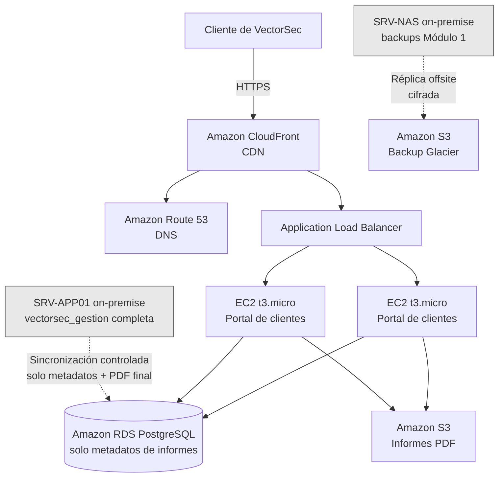

# Módulo 6 — Fundamentos de Computación en la Nube (AWS)

**Empresa:** `VectorSec`

**Sector:** `Ciberseguridad` — `auditoría, pentesting y formación en seguridad informática`

**Alcance:** análisis y diseño de una arquitectura cloud — *no se despliega la infraestructura interna completa en la nube*.

---

## 1. Planteamiento: ¿Qué se lleva a la nube y qué no?

Antes de elegir servicios, hay que responder una pregunta previa: ***¿tiene sentido migrar toda la infraestructura de VectorSec a AWS?***. La respuesta, razonada, es que no — *y explicarlo es en sí mismo parte del análisis que pide este módulo*.

`VectorSec` es una empresa de ciberseguridad. Su activo más sensible — los datos de auditorías, hallazgos y clientes (`vectorsec_gestion`, Módulo 4) — vive de forma deliberada en infraestructura propia, con acceso restringido por VLAN, ACLs y permisos de base de datos (Módulos 2, 3 y 4). Trasladar esos datos a un proveedor externo sin una razón de negocio real contradiría la misma lógica de control y responsabilidad que la empresa aplica sobre sí misma — teniendo en cuenta el mismo criterio que ya justificó, por ejemplo, aislando `SRV-LAB01` en su propia VLAN.

Lo que **sí** tiene sentido llevar a la nube es aquello que se beneficia genuinamente de las ventajas del cloud (**alcance público, elasticidad, redundancia geográfica**) sin comprometer esa premisa:

1. **Un portal de clientes**, donde cada cliente pueda consultar y descargar los informes finales de sus proyectos (Módulo 4) — *una funcionalidad de cara al exterior, que no requiere exponer la base de datos interna completa*.
2. **Una réplica offsite de las copias de seguridad**, complementando el backup ya existente en `SRV-NAS` (Módulo 1) con una copia fuera de las instalaciones — *esta es **la mejora real de continuidad de negocio ante un desastre físico en el CPD***.

---

## 2. Elección de proveedor cloud

### 2.1 Proveedor elegido: **Amazon Web Services (AWS)**

### 2.2 Por qué AWS

- **Es el proveedor líder del mercado**, con la documentación, comunidad y oferta de servicios gestionados más extensa — *relevante para este proyecto inicial de aprendizaje, ya que la mayoría de problemas ya están documentados y resueltos por otros*.
- **Nivel gratuito (Free Tier) generoso durante 12 meses**, que permite desplegar una arquitectura de prueba real sin coste, algo especialmente valioso en la fase actual de `VectorSec` como empresa que optimiza recursos (*mismo criterio aplicado en todos los módulos anteriores*).
- **Integración natural con el ecosistema ya elegido en el proyecto:** `VectorSec` ya usa Linux (Ubuntu Server, Kali) en su infraestructura on-premise (Módulo 2) — *AWS ofrece el soporte más maduro y documentado para cargas de trabajo Linux de cualquiera de los tres grandes proveedores*.
- **Granularidad de permisos (IAM):** permite aplicar el mismo principio de mínimo privilegio que ya se ha aplicado de forma consistente en ACLs de red (Módulo 3), permisos NTFS (Módulo 2) y roles de base de datos (Módulo 4) — *coherencia de criterio de seguridad en toda la infraestructura, dentro y fuera de las instalaciones propias*.

### 2.3 Ventajas concretas para este proyecto

- El portal de clientes tiene un patrón de tráfico impredecible (picos cuando se entrega un informe) — *la elasticidad de AWS permite no pagar por capacidad ociosa el resto del tiempo*.
- El backup offsite en S3 tiene clases de almacenamiento de muy bajo coste para datos que casi nunca se leen (Glacier), ideal para un histórico de copias de seguridad.

---

## 3. Arquitectura propuesta

### 3.1 Cómo funciona, paso a paso

1. El cliente accede al portal mediante un dominio público (ej. `portal.vectorsec.es`), resuelto por **Route 53** (DNS) y servido a través de **CloudFront**, que cachea contenido estático y reduce la carga sobre los servidores de aplicación.
2. El **Application Load Balancer** reparte las peticiones entre dos instancias **EC2** (para evitar un punto único de fallo — mismo principio de redundancia ya aplicado en `SRV-NAS` con el Hot Spare, Módulo 1).
3. Las instancias EC2 ejecutan la aplicación del portal, que consulta una base de datos **RDS** — pero esta base de datos **no es una copia de `vectorsec_gestion`**: contiene únicamente los metadatos necesarios para el portal (*qué informes existen, a qué cliente pertenecen, fecha*), nunca los hallazgos de seguridad detallados ni datos internos de proyectos en curso.
4. Los informes en PDF se almacenan y descargan desde **S3**, con acceso controlado por credenciales temporales (URLs firmadas), sin exponer el bucket públicamente.
5. La sincronización entre `SRV-APP01` (on-premise) y la base de datos del portal (RDS) es **unidireccional y selectiva**: solo se envían metadatos de proyectos ya finalizados, nunca el conjunto completo de la base de datos interna.
6. En paralelo, `SRV-NAS` replica sus copias de seguridad (Módulo 1) hacia un *bucket S3* con clase de almacenamiento **Glacier**, pensado para datos de recuperación ante desastres que rara vez se necesitan leer.

> 📌 **Por qué esto es coherente con el resto del proyecto:** la arquitectura respeta exactamente la misma frontera de confianza que ya se estableció con las VLANs y las ACLs del Módulo 3 — *el dato sensible (hallazgos, detalle de auditorías) nunca sale del perímetro de `VectorSec`; lo único que cruza hacia la nube es lo estrictamente necesario para el servicio público*.

---

## 4. Servicios cloud utilizados

| Servicio AWS | Función | Por qué este y no otro |
| :--- | :--- | :--- |
| **Amazon EC2** (*t3.micro, en Auto Scaling Group de 2 instancias*) | Ejecuta la aplicación del portal de clientes | Tamaño mínimo suficiente para el volumen de tráfico esperado; 2 instancias evitan un punto único de fallo |
| **Application Load Balancer** | Reparte el tráfico entre las instancias EC2 y gestiona el certificado TLS | Necesario en cuanto hay más de una instancia; centraliza el cifrado HTTPS |
| **Amazon RDS para PostgreSQL** (*db.t3.micro*) | Base de datos del portal (*solo metadatos de informes*) | Mismo motor que ya se usa en `SRV-APP01` (Módulo 2) — *coherencia tecnológica, sin necesidad de aprender/mantener un segundo motor de BD distinto* |
| **Amazon S3** | Almacenamiento de los PDF de informes + backups offsite | Almacenamiento de objetos económico, con clases de coste distintas según frecuencia de acceso |
| **Amazon CloudFront** | CDN — *distribuye contenido estático cerca del usuario* | Reduce la carga sobre las instancias EC2 y mejora el tiempo de respuesta para clientes en distintas ubicaciones |
| **Amazon Route 53** | Gestión del dominio público del portal | Servicio DNS gestionado, integrado de forma nativa con el resto de servicios AWS elegidos |
| **AWS IAM** | Roles y permisos de mínimo privilegio para cada servicio | Ninguna instancia o servicio tiene más permisos de los estrictamente necesarios — *mismo criterio ya aplicado en toda la infraestructura on-premise* |

> 📌 No se incluyen contenedores (ECS/EKS) ni funciones serverless (Lambda) en esta primera propuesta: con el volumen de tráfico actual de `VectorSec`, añadirían complejidad de orquestación sin un beneficio claro todavía — *se documentan como posible evolución futura si el portal creciera significativamente, mismo criterio de "mejora futura declarada, no aplicada por no ser necesaria ahora" usado con el switch de Capa 3 (Módulo 3) y el segundo controlador de dominio (Módulo 2)*.

---

## 5. Estimación de costes

⚠️ Estimación aproximada, calculada sobre precios de referencia de la región **eu-west-3 (París)**, la más cercana a *España* dentro de la UE. Los precios de AWS cambian con el tiempo — *para una cifra exacta y actualizada, se recomienda la [Calculadora de precios de AWS](https://calculator.aws/)*.

| Servicio | Configuración | Coste aproximado/mes | ¿Cubierto por Free Tier (12 meses)? |
| :--- | :--- | :--- | :--- |
| EC2 (*×2 t3.micro*) | Auto Scaling, uso continuo | ~15 € (1ª instancia gratis el primer año, 2ª a coste completo) | Parcial |
| Application Load Balancer | 1 balanceador | ~18 € | No |
| RDS PostgreSQL (*db.t3.micro*) | Single-AZ | ~14 € | Sí, el primer año |
| Amazon S3 (*informes*) | ~5 GB almacenados | ~1 € | Sí (*hasta 5 GB*) |
| Amazon S3 Glacier (*backups offsite*) | ~20 GB almacenados | ~0,20 € | No |
| CloudFront | Tráfico bajo-medio | ~2 € | Sí (*hasta 1 TB*) |
| Route 53 | 1 zona alojada + consultas | ~1 € | No |
| **Total estimado** | | **≈ 51 €/mes** | **≈ 15-20 €/mes durante el primer año** |

> 📌 **Lectura de esta tabla:** durante el primer año de uso, gracias al **Free Tier**, el coste real rondaría los **15-20 €/mes** — *principalmente el Load Balancer y la segunda instancia EC2, que no tienen nivel gratuito*. A partir del segundo año, sin Free Tier, el coste se estabiliza en torno a **50 €/mes**. Para una empresa en fase de crecimiento como `VectorSec`, es una cifra perfectamente asumible para el valor que aporta (*portal público + redundancia de backups*), y notablemente inferior al coste de mantener y asegurar esta misma disponibilidad con hardware propio adicional.

---

## 6. Conclusiones

La arquitectura propuesta no busca trasladar `VectorSec` a la nube "porque es lo moderno", sino identificar con criterio qué parte de la infraestructura se beneficia realmente de estar ahí. El resultado es una extensión cloud que amplía el alcance de la empresa (*portal público de clientes*) y refuerza su continuidad de negocio (*backup offsite*), sin renunciar al control que una empresa de ciberseguridad debe mantener sobre sus datos más sensibles — *exactamente la misma cautela que ha guiado cada decisión de diseño desde el Módulo 1*.

Como en el resto del proyecto, se documentan explícitamente las decisiones de alcance (*qué se lleva a la nube y qué se queda on-premise, y por qué*) y las mejoras futuras **descartadas por el momento** (*contenedores, funciones serverless*), en lugar de dar la sensación de que la arquitectura propuesta es la única posible.

---

## 7. Entregables

- Este mismo documento (`README.md`), que incluye:
  - investigación del proveedor
  - arquitectura propuesta
  - diagrama (Mermaid, renderizado nativamente en GitHub)
  - servicios utilizados y
  - estimación de costes.
